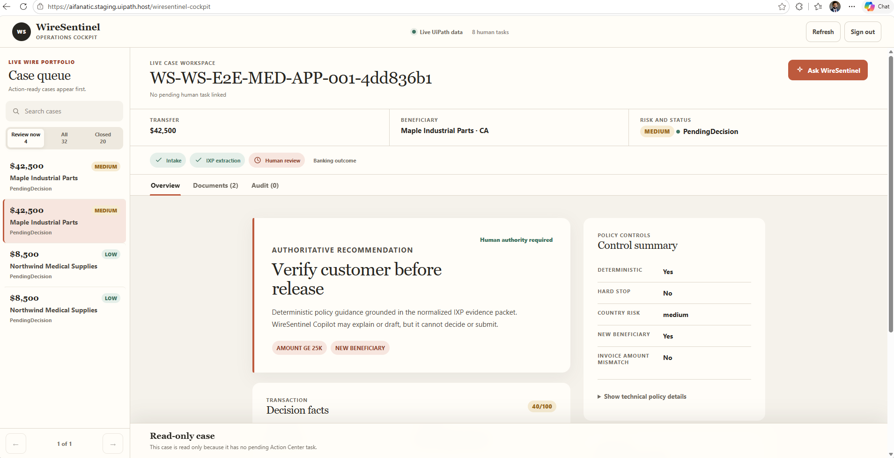
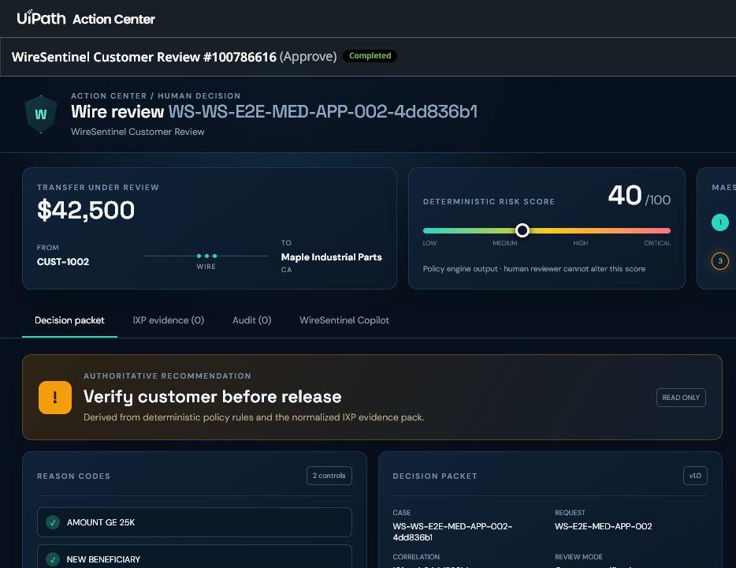
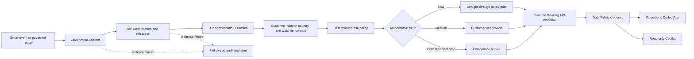

# WireSentinel

**Explainable, human-governed suspicious-wire review orchestrated with UiPath Maestro.**

[](https://www.uipath.com/product/maestro)
[](#operations-experience)
[](LICENSE)

[Open the live WireSentinel cockpit](https://aifanatic.staging.uipath.host/wiresentinel-cockpit) · [Read the architecture and component guide](output/pdf/WireSentinel-Architecture-and-Demo-Guide.pdf) · [Download the clean Studio Web source](release/WireSentinel-Challenge-1.1.17-UI-Final.uis)

> The live cockpit is hosted in a UiPath staging environment and may require authentication. WireSentinel is a synthetic reference implementation: it does not move production funds or file real regulatory reports.

## What problem does it solve?

A suspicious outbound wire rarely arrives as one perfect record. An operations reviewer must reconcile the payment instruction, supporting invoice, customer history, beneficiary context, watchlist signals, policy, and prior decisions—often across several systems. Manual handoffs make that review slow, difficult to explain, and vulnerable to missed evidence or duplicate execution.

WireSentinel turns those handoffs into one governed journey:

- **IXP extracts evidence** from the submitted documents.
- **Deterministic policy calculates the authoritative risk route.**
- **Action Center keeps elevated decisions with an authorized human.**
- **A guarded API Workflow records only an authorized synthetic banking outcome.**
- **Data Fabric preserves the case, documents, audit events, policy, and ledger evidence.**
- **A read-only Copilot explains the evidence without gaining approval or mutation authority.**

The core design principle is simple: **AI extracts and explains; policy routes; people authorize; Maestro orchestrates.**

## Operations experience

[](https://aifanatic.staging.uipath.host/wiresentinel-cockpit)

*The Coded Web App presents an action-first case queue, focused review canvas, document and audit evidence, and the case-scoped Ask WireSentinel drawer.*



*The Coded Action App uses the same review workspace inside Action Center and becomes read-only after the task is completed.*

## Reference Medium-risk scenario

The reference scenario uses the two synthetic files in `sample-data/`:

- `WS-E2E-MED-002_wire.pdf` — the payment instruction: request, customer, amount, beneficiary, destination, and routing evidence.
- `WS-E2E-MED-002_invoice.pdf` — the business justification: supplier, invoice number, and invoice total.

The wire instruction is required by the current contract; the supporting invoice is technically optional. Both are used because the reference scenario is about **cross-document validation**, not merely reading a single PDF. IXP classifies and extracts each document, then WireSentinel checks whether the instruction is supported by the invoice. Unsupported or excess documents and material amount mismatches become deterministic hard-stop signals. Confidence values are preserved as evidence, although the current executable policy does not yet enforce confidence thresholds.

For the proven Medium scenario, the deterministic policy produces:

| Fact | Result |
|---|---|
| Transfer | USD 42,500 to Maple Industrial Parts in Canada |
| Risk | Medium, score 40/100 |
| Reason codes | `AMOUNT_GE_25K`, `NEW_BENEFICIARY` |
| Recommendation | Verify customer before release |
| Human outcome | Approve |
| Final status | `ReleasedAfterVerification` |

## Architecture



UiPath Integration Service supplies the Gmail and Google Sheets connections. Maestro owns the long-running state, waits, routing, and recovery. The model never owns a release, rejection, hold, or regulatory decision.

## Solution projects

`WireSentinelChallenge117UiFinal.uipx` registers eight UiPath projects:

| Project | UiPath type | Responsibility |
|---|---|---|
| `WireSentinelFlow` | Maestro Flow | Intake, orchestration, deterministic routing, HITL waits, recovery, and final audit |
| `WireSentinelIxpAdapter122` | Function | Runs and normalizes IXP document predictions into a bounded evidence contract |
| `WireSentinelExtractionAgent` | Agent | Preserves an alternative agentic extraction design and its evaluation assets; it is not the primary extraction path in the same run |
| `WireSentinelBankingAdapter` | API Workflow | Enforces authorization, idempotency, and sandbox-only banking outcomes |
| `WireSentinelCopilotQueryApi` | API Workflow | Performs bounded, masked, read-only Data Fabric queries |
| `WireSentinelCopilot` | Agent | Explains case, document, policy, and audit evidence |
| `WireSentinelApp` | Coded Web App | Hosts the live operations cockpit |
| `WireSentinelReviewAction` | Coded Action App | Renders Action Center review tasks and `Approve` / `Reject` / `Escalate` outcomes |

`WireSentinelCockpitShared` is the internal React package shared by both Coded Apps, so it is source code but not a ninth UiPath project.

### External Attachment Adapter dependency

The Flow also calls a previously published `WireSentinelAttachmentAdapter` process to materialize Gmail attachment payloads as UiPath files before IXP runs. That process is an environment dependency, not one of the eight projects registered in this source solution. Importers must publish or select a compatible adapter and rebind that activity in Studio Web.

## Data Fabric evidence model

| Entity | Purpose |
|---|---|
| `WireSentinelCase` | Authoritative case lifecycle, risk, recommendation, and final decision |
| `WireSentinelDocument` | Document inventory, IXP classification, extraction confidence, and normalized evidence |
| `WireSentinelAuditEvent` | Append-oriented timeline of automated, agent, human, and adapter outcomes |
| `WireSentinelBankingAction` | Correlation-keyed proof of the guarded synthetic action and duplicate suppression |
| `WireSentinelPolicySection` | Grounding material for bounded policy explanations and citations |

The cockpit reads these records as the operational portfolio. The Copilot reaches them only through the masked query API; it has no direct Data Fabric write capability.

## How Ask WireSentinel works

The cockpit opens a case-scoped conversational drawer backed by `WireSentinelCopilot`. The current agent configuration uses `anthropic.claude-sonnet-4-6` with temperature `0` and a 4,096-token response limit. Every operational answer must first call the single `WireSentinelOperationalQuery` tool, which returns bounded and masked Data Fabric evidence.

The agent is instructed to:

- answer only from the current tool result, not model memory;
- cite returned business keys such as case, document, audit, and policy keys;
- distinguish extracted evidence from policy decisions and completed human actions;
- preserve masking and refuse disclosure of account, routing, credential, or raw extraction data;
- refuse approval, release, rejection, hold, freeze, filing, and record mutation requests.

Copilot can summarize or draft reviewer rationale, but it cannot submit the task. The human remains the authority boundary.

## Import and rebind

1. Download [`WireSentinel-Challenge-1.1.17-UI-Final.uis`](release/WireSentinel-Challenge-1.1.17-UI-Final.uis).
2. In UiPath Studio Web, choose **Import project / solution** and select the `.uis` file.
3. Rebind the Integration Service connections for Gmail and Google Sheets.
4. Map the five Data Fabric entities to entities in the target tenant and seed the synthetic policy records.
5. Select the IXP project/model resources used for the wire instruction and invoice.
6. Publish or select the external Attachment Adapter dependency and bind both attachment-materialization calls.
7. Confirm the Coded Action App, API Workflow, and agent references.
8. Assign the Action Center tasks to an appropriate reviewer or group.
9. Build the Coded Apps, run a Studio Web debug with the supplied PDFs, and enable the Gmail trigger only when the target connections are ready.

Do not reuse source-environment resource identifiers as production configuration. The public source deliberately excludes tenant connection exports, user profiles, debug overrides, credentials, and tokens.

## Local Coded App checks

Requirements: Node.js 22+, Python 3.11+, and the UiPath CLI (`uip`).

```powershell
npm ci
npm test
npm run build
```

Run the Web cockpit locally:

```powershell
npm run dev --workspace WireSentinelApp
```

Run the Action App locally:

```powershell
npm run dev --workspace WireSentinelReviewAction/source
```

## Validation status

- The clean source `.uis` in `release/` has strict `uip solution pack --dry-run` status **Valid** with the pinned release toolchain, UiPath CLI `1.197.1`.
- Its SHA-256 is `FADD8DF36048D525E7405530DFC98946C04EA8DF48AE170BD302D4AE214B9BF9`.
- Eight Coded App tests cover queue search, ordering, filtering and pagination; pending/completed/read-only tasks; specialized-task routing; rationale validation; Copilot connection and streaming states; and Markdown rendering.
- The Web and Action apps build without TypeScript or Vite errors at version `1.2.3`.
- A verified Medium reference run exercised two-document IXP extraction, deterministic score 40, an Action Center approval, Maestro continuation, a sandbox release, Data Fabric write-back, cockpit visibility, and the structured outcome email.

### Known CLI compatibility note

The Studio Web Flow 1.9 serialization was normalized to Flow schema 1.8 for clean solution packaging with UiPath CLI `1.197.1`. The CI workflow pins that version for reproducibility because CLI `1.198.0` attempts an unsupported 1.8-to-1.9 migration for this export. This is a tooling compatibility constraint; it does not change the route or decision logic.

Standalone `uip maestro flow validate` still reports the known Coded Action App HITL `completed`-port mismatch. The solution-level dry-run is Valid, and the affected Medium HITL path has been exercised successfully in Studio Web. The standalone warning is therefore documented rather than hidden.

## Known limitations

- WireSentinel uses synthetic documents, reference data, identities, and banking outcomes.
- The banking adapter records a sandbox result; it does not integrate with a core banking system.
- The executable route set is Low, Medium, and Critical. A distinct High manager route and Invalid Document Exception route remain design extensions, not active paths.
- The narrative policy files and executable scoring script are not fully aligned: their score bands, straight-through threshold, mismatch rule, and confidence guidance differ. The Flow script is authoritative for the reference implementation.
- Customer and transaction-history sheets are read for context but are not yet factors in the executable score; all Google Sheets data is synthetic reference data.
- Data Fabric audit records are append-oriented by application convention, not immutable-storage enforcement, and target-tenant RBAC must be verified after import.
- Copilot queries case, document, audit, and policy evidence; it does not query the Banking Action entity directly.
- The Web App requires target-tenant entity IDs through its environment variables; specialized-task detection also requires target-tenant verification.
- The structured result email includes routing/SWIFT evidence in the synthetic sample output; a production adaptation must mask or omit it.
- The live URL and connected staging instance require the configured tenant and may not be anonymously accessible.
- Connection, entity, IXP, reviewer, and external process mappings are environment-specific after import.
- The repository demonstrates governance patterns; production rollout would still require formal access design, segregation of duties, data retention, monitoring, model governance, and operational support.

## Repository map

```text
.
├── WireSentinelChallenge117UiFinal.uipx
├── WireSentinelFlow/
├── WireSentinelIxpAdapter122/
├── WireSentinelExtractionAgent/
├── WireSentinelBankingAdapter/
├── WireSentinelCopilotQueryApi/
├── WireSentinelCopilot/
├── WireSentinelApp/
├── WireSentinelReviewAction/
├── WireSentinelCockpitShared/
├── data-fabric/
├── policies/
├── sample-data/
├── evidence/
├── docs/
├── output/pdf/
├── release/
├── CONTRIBUTING.md
└── LICENSE
```

## Documentation and community

- [Architecture and component guide](output/pdf/WireSentinel-Architecture-and-Demo-Guide.pdf)
- [Security and authority model](docs/SECURITY.md)
- [Contributing guide](CONTRIBUTING.md)
- [MIT license](LICENSE)
- [Clean Studio Web source export](release/WireSentinel-Challenge-1.1.17-UI-Final.uis)

## License

WireSentinel source code and project documentation are available under the [MIT License](LICENSE). UiPath product names and trademarks belong to UiPath, and third-party packages remain subject to their respective licenses.
